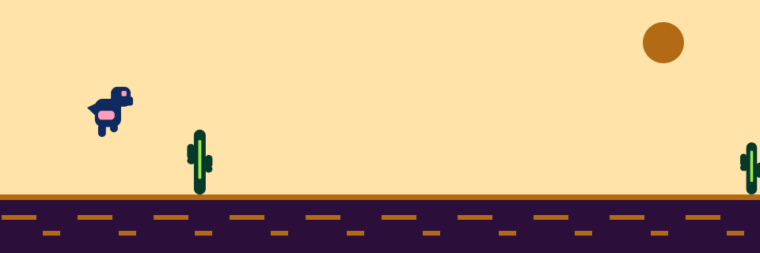
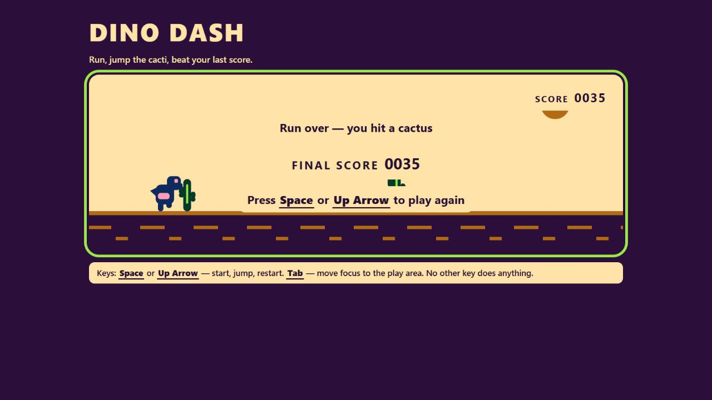
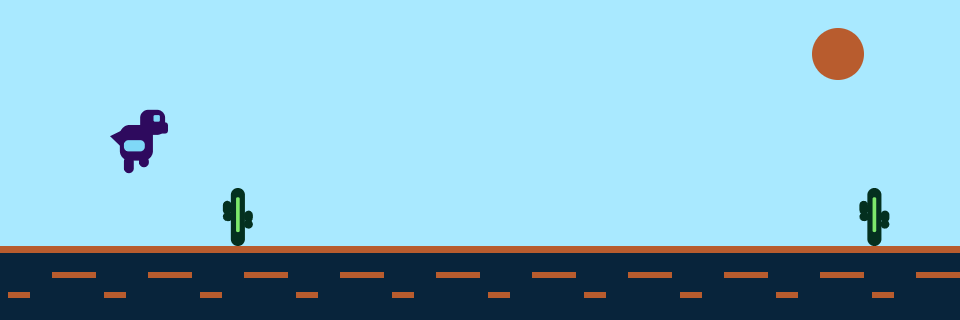
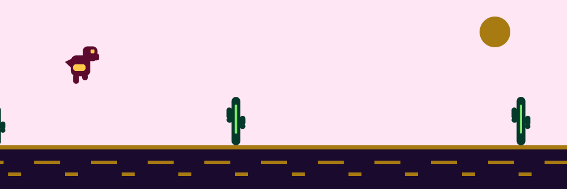
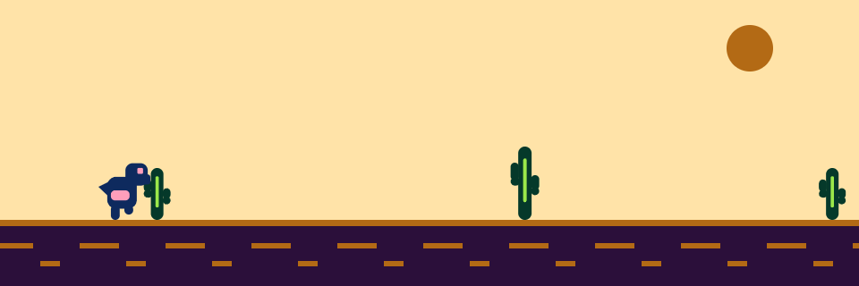

<div align="center">

# 🦕 Dino Dash

**A modern, colourful endless runner for the browser.**
Run, jump the cacti, beat your last score.

*No build step. No dependencies. No network. No tracking. Just open it and play.*



[](https://github.com/sedwna/open-product-operations-os)
[](#-how-it-is-built)
[](#-accessibility-is-not-a-phase)

</div>

---

## Benchmark: architecture vs. a raw prompt

This game was used in a controlled case study comparing two outputs from **the same Claude Sonnet model and the same product prompt**: one direct-prompt implementation and one produced through the Product/Development Operations OS.

The structured implementation scored **88/100** across the evidenced categories, compared with **63/100** for the direct-prompt baseline, and delivered **114 passing automated tests versus none**. The baseline remained stronger in immediate feature density.

**The visual comparison was withdrawn on review.** Neither game had actually been seen rendered when the original graphics score was assigned — it was inferred from a feature list. Which of the two looks better is unresolved, and the scorecard now says so instead of guessing.

Read the methodology, full weighted scorecard, evidence, and limitations in **[BENCHMARK.md](BENCHMARK.md)**.

---

## ▶️ Play it in 30 seconds

### Actual browser capture



Captured from the running game on 2026-10-07 after starting a round with Space. This is the actual game UI, not a concept illustration. No network calls or player accounts are involved.

You need [Node.js](https://nodejs.org) 20 or newer. Nothing else.

```bash
git clone https://github.com/sedwna/dino-dash.git
cd dino-dash
node tests/tools/static-server.mjs 4173
```

Open **<http://localhost:4173>** and press **Space**.

> **Why a server and not just double-clicking the file?**
> The game ships as native ES modules. Browsers refuse to load modules over `file://`,
> so it needs any static server — the one above, `npx serve src`, or `python -m http.server`
> run from inside `src/`. There is no build, no bundler, and nothing to install.

### Controls

| Key | What it does |
| --- | --- |
| <kbd>Space</kbd> or <kbd>↑</kbd> | Start · Jump · Restart |
| <kbd>Tab</kbd> | Move focus to the play area |

That is the whole control surface. **Every function is reachable by keyboard alone** — no mouse needed, ever. No other key does anything, and the game tells you so on screen.

---

## 🎨 Three times of day

The palette shifts as you survive. Every colour in the game comes from a single source file, and every pair is contrast-checked.

| Dawn — from score 0 | Noon — from score 100 | Dusk — from score 200 |
| --- | --- | --- |
|  |  |  |

And when you clip a cactus, the run ends right there:

<div align="center">

</div>

---

## ♿ Accessibility is not a phase

Most projects put accessibility in a "polish" phase at the end, where it quietly gets cut. Here it was made **cross-cutting from the first line of the contract**, with numbers attached so it could actually be tested:

- **Text contrast ≥ 4.5 : 1** — measured **11.9 : 1 to 15.8 : 1**
- **Game elements ≥ 3 : 1** against their actual background — measured **3.07 : 1 to 11.9 : 1**
- **33 colour pairs** checked across all three palettes — **0 failures**
- Full keyboard operability, a visible focus ring, and no focus trap
- Every key with an effect is named on screen

The contrast maths lives in [`src/render/palette.js`](src/render/palette.js) and runs as part of the test suite, so a colour change that breaks the threshold **fails the build**, not the user.

**Known limitation, stated plainly:** the play field is a `<canvas>` and is `aria-hidden`. Gameplay itself is not conveyed to a screen reader. That was recorded as a limitation, not quietly dressed up as a satisfied requirement.

---

## 🔬 How it is built

```
src/
├── index.html            single entry point
├── main.js               bootstrap and wiring
├── engine/
│   ├── clock.js          injectable monotonic + wall clock
│   └── loop.js           requestAnimationFrame loop
├── game/                 ← pure logic, zero DOM
│   ├── state-machine.js  idle → running → run-end
│   ├── run-state.js      createRunState(), frozen config
│   ├── physics.js        gravity, jump, delta-time clamp
│   ├── obstacles.js      cactus spawn / advance / despawn
│   ├── collision.js      AABB with a 6px forgiveness inset
│   ├── score.js          integer, monotonic, time-derived
│   └── simulation.js     one frame of a run
├── render/
│   ├── palette.js        every colour + WCAG maths
│   └── canvas-renderer.js
├── input/keyboard.js     Space and ↑ only
└── trace/score-trace.js  the run record
```

**The core is DOM-free on purpose.** Everything under `game/`, `trace/`, `engine/clock.js` and `render/palette.js` runs in plain Node with no browser at all. That is why the whole run loop can be tested without a headless browser:

```bash
node --test "tests/unit/*.test.mjs"
```

**114 assertions, 114 passing, zero dependencies — and `npm test` needs no install step at all.** They cover the state transition table and its no-ops, jump edge semantics, the delta-time clamp, score monotonicity, collision geometry, obstacle lifecycle, the trace record shape, a whole-run integration that plays a real game frame by frame with an injected clock and a seeded random source, plus regression guards for a latent prototype-chain defect the security review found and the absence of every storage, network and identity API.

### The score trace

Every finished run appends one record, held in memory only:

```js
window.dinoDash.getScoreTrace()
// [{ score: 282, endedAt: "2026-08-10T18:12:04.317Z", sessionLengthMs: 28317 }]
```

`sessionLengthMs` comes from a **monotonic** clock, not from subtracting two wall-clock readings — so moving your system clock mid-run does not corrupt it.

This shape exists for a reason. A later unit adds a shared score table among friends, and it will need exactly these fields. Designing the shape now costs almost nothing; retrofitting it later would mean rewriting the run loop.

**It is not evidence, and it does not pretend to be.** Every field is produced by code on your machine and every field is forgeable from the browser console. Its value is *shape*, not integrity. Server-side validation belongs to the unit that actually shares scores — and that was written down as an accepted consequence, not discovered later as a surprise.

### What it deliberately does not do

No persistence · no network after load · no accounts · no nicknames · no leaderboard · no character catalogue · no analytics · no cookies · no telemetry.

Play it offline. Check the network tab. It stays empty.

---

## 🏗️ Built by an operating system for product work

This game was not written by someone opening an editor and typing.

It was produced by **[Open Product Operations OS](https://github.com/sedwna/open-product-operations-os)** — an open-source operating system that runs product development as two separate organisations exchanging versioned contracts:

- a **product side** that owns meaning, priority and acceptance
- an **engineering side** that owns implementation and technical evidence

Neither side writes the other's claims. They meet at a contract, and a human product owner holds every gate that matters.

### The path this game actually took

```
idea → triage → discovery → decision brief → ⛔ HUMAN GATE
     → topology & journeys → issues → delivery contract → validation design
     → ⛔ HUMAN GATE → engineering plan → 14 workstreams → independent verification
     → back to product for QA, controlled write, and release readiness
```

Every step left a sealed, immutable record. Some things that fell out of running it this way:

- **The five-phase idea was split into five independent units by the owner**, not by an agent. Unit 1 — this game — had to be playable entirely on its own, and every later unit may only *add* to it.
- **"Live competition with friends" was ambiguous**, so it was raised as a decision rather than guessed. The owner chose compare-after-the-fact over simultaneous play, which removed server-authoritative sessions, matchmaking, presence and the entire latency budget from scope in one sentence.
- **"Sufficient contrast" was refused as untestable** until it had a number. It became 4.5 : 1 and 3 : 1.
- **"Fair jump timing" has no test**, because no frame-time budget exists to test it against. That is recorded as a declared gap. Inventing a threshold would have been worse than admitting there isn't one.
- **No user research stands behind this product**, and the record says so in as many words. It rests on the owner's own knowledge of their friend group. Nothing here is dressed up as validated demand.

The whole audit trail — every decision, every risk, every thing that was *not* known — lives in the product workspace alongside the code.

> If you build products with agents, the interesting part is not that an agent wrote a game.
> It is that the agent could not approve its own scope, could not verify its own work,
> and could not quietly turn "I couldn't reach that source" into "that source says nothing."

---

## 🗺️ Where this is going

| Unit | What it adds | Status |
| --- | --- | --- |
| **1 — Base game** | run, jump, collide, score, restart | ✅ **this release** |
| 2 — Personal best | saved locally, same device | planned |
| 3 — Shared score table | compare-after-the-fact among friends | planned |
| 4 — Player profile | — | planned |
| 5 — Unlockable characters | — | planned |

Units 2–5 are deliberately not started. Unit 1 stands alone, and that was the point.

---

## 📄 Licence & credits

Built with **[Open Product Operations OS](https://github.com/sedwna/open-product-operations-os)** — the open-source product-and-engineering operating system that produced this repository's contracts, decisions and evidence trail.

Inspired by the offline dinosaur runner that ships in Chromium. No code was taken from it; the difficulty curve, palette, physics and architecture here are original.

<div align="center">

**Press Space. 🦕**

</div>
